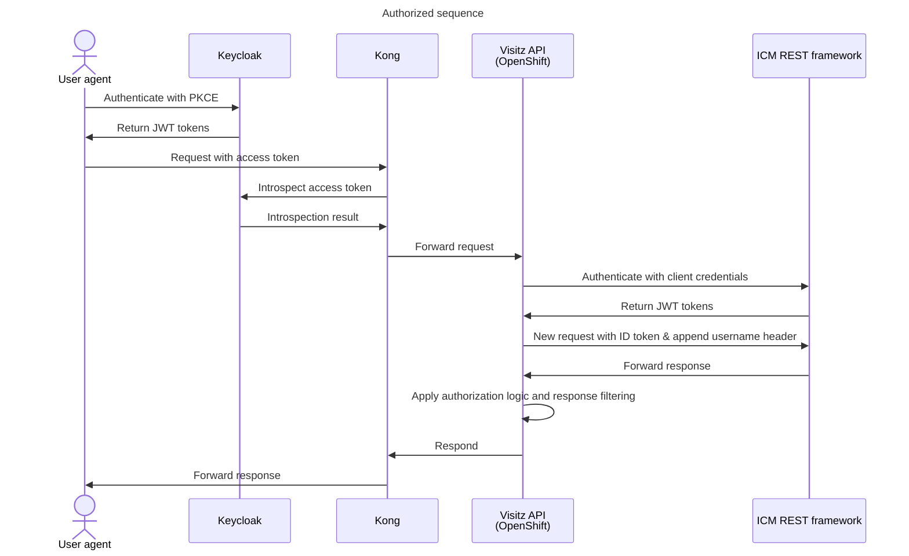

Additional information:

- [ICM REST framework](https://dev.azure.com/bc-icm/SiebelCRM%20Lab/_wiki/wikis/SiebelCRM-Lab.wiki/575/Siebel-Application-Client-ID-(Service-Account)-Operation-for-DATA-API)
